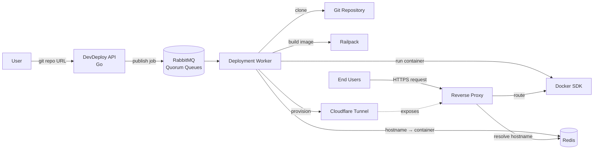
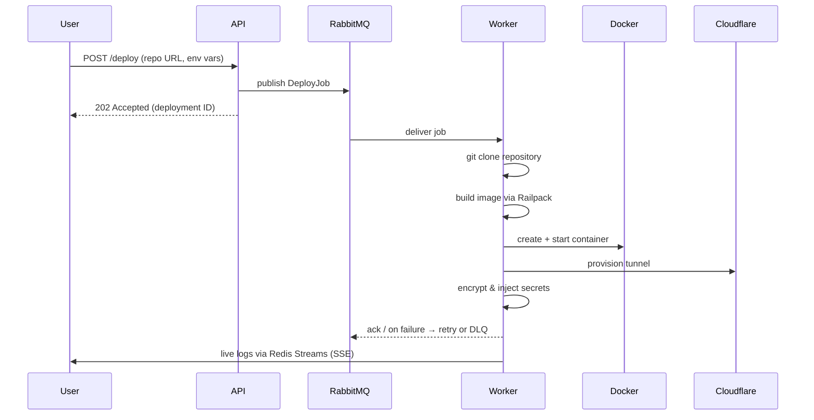
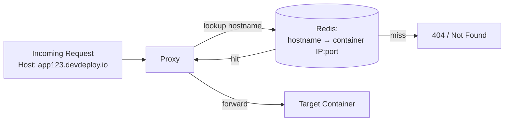
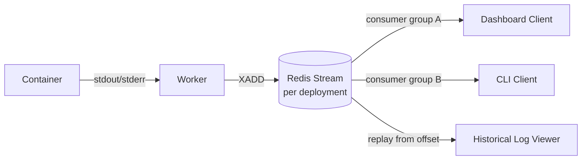
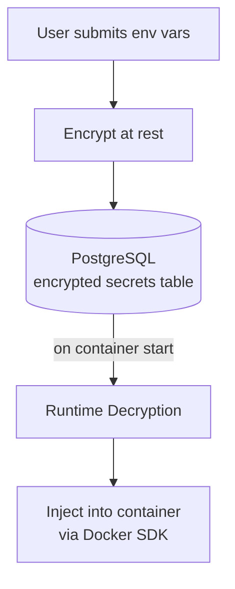

# DevDeploy — Architecture

A self-hosted Platform-as-a-Service (PaaS) written in Go. Point it at a Git repo and it builds, containerizes, deploys, and exposes the app on a public URL — no manual server config required.

**Stack:** Go · Docker SDK · Railpack · PostgreSQL · RabbitMQ (AMQP 1.0) · Redis · Cloudflare Tunnels

---

## 1. High-Level Overview

The system has four moving parts: an **API** that accepts deploy requests, a **queue** that decouples request handling from the actual build/deploy work, a pool of **workers** that do the heavy lifting, and a **reverse proxy** that routes live traffic to the right container.

---

## 2. Deployment Pipeline (Async, Queue-Driven)

- **Quorum queues (AMQP 1.0)** give durable, broker-managed delivery.
- **Broker-managed delayed retries** handle transient failures (e.g. registry timeouts) without custom retry loops.
- **Dead-letter queues (DLQ)** catch jobs that exhaust retries, so failed builds never vanish silently — they're inspectable and re-playable.

---

## 3. Multi-Tenant Reverse Proxy

Each deployed app gets a unique hostname mapped to its container in Redis. The proxy does an O(1) lookup per request — no static config, no restarts needed when a new app goes live. This is what makes deployments **zero-configuration**: register the mapping once, and routing "just works."

---

## 4. Real-Time Log Aggregation

Redis Streams act as an append-only log per deployment:
- **Live tailing**: multiple consumers can subscribe concurrently without contention.
- **Replay**: any client can request logs from an arbitrary offset — useful for reconnects or post-mortem debugging.

---

## 5. Secrets Management

Secrets are never stored in plaintext or baked into images. They're decrypted only at container-start time and injected directly through the Docker SDK's environment configuration — keeping them out of build logs, image layers, and version control.

---

## 6. Component Responsibilities

| Component | Responsibility |
|---|---|
| **API** | Accepts deploy requests, validates input, publishes jobs, exposes deployment status |
| **RabbitMQ** | Durable job queue with quorum replication, delayed retry, and DLQ |
| **Worker** | Clone → build (Railpack) → containerize (Docker SDK) → tunnel (Cloudflare) → register (Redis) |
| **Redis (routing)** | Hostname → container resolution for the reverse proxy |
| **Redis (streams)** | Real-time + replayable log delivery |
| **PostgreSQL** | Durable state: deployments, encrypted secrets, metadata |
| **Reverse Proxy** | Routes public traffic to the correct container based on hostname |
| **Cloudflare Tunnels** | Exposes containers publicly without opening inbound ports on the host |

---

## 7. Key Design Decisions

- **Async by default** — build/deploy is decoupled from the request/response cycle via RabbitMQ, so the API stays responsive even under long builds.
- **Redis as a routing table, not a cache** — treating hostname resolution as source-of-truth-adjacent data keeps the proxy stateless and horizontally scalable.
- **Quorum queues over classic queues** — chosen for stronger durability guarantees on deployment jobs, where losing a job means a silently failed deploy.
- **No inbound ports** — Cloudflare Tunnels mean the host never needs a public IP or firewall rules, reducing attack surface.
